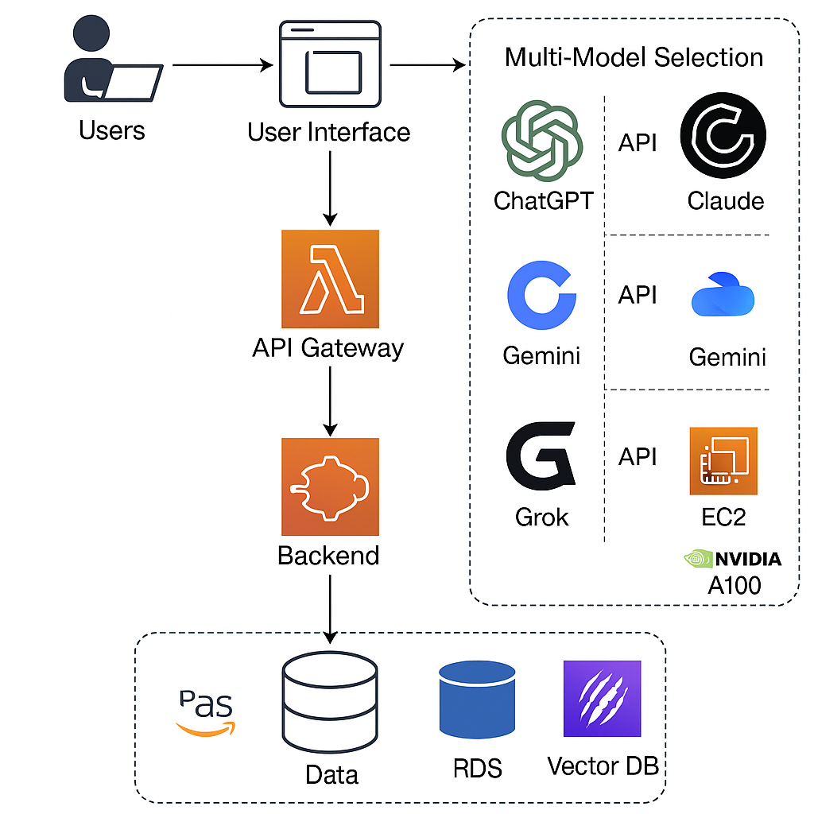

# Enterprise AI Platform (Multi-Model)

This project provides an **enterprise-ready AI chat platform** where users can select which LLM (ChatGPT, Claude, Gemini, or Grok) to interact with. 
It integrates multiple APIs and allows self-hosting of models on AWS GPUs.

---

## 📂 Directory Structure

```
enterprise-ai-platform/
├── README.md                # Documentation
├── backend/                 # FastAPI orchestrator
│   ├── app.py               # Main backend code
│   ├── requirements.txt     # Python dependencies
│   └── .env.example         # Example environment config
├── frontend/                # User-facing chat interface
│   └── index.html           # Simple UI
├── infra/                   # Infrastructure as code
│   ├── ecs-task-def.json    # ECS task definition
│   ├── eks-deployment.yaml  # EKS deployment
│   └── api-gateway-config.json # API Gateway setup
├── docker-compose.yml       # Local dev setup
└── docs/                    # Documentation assets
    └── architecture.png     # AWS architecture diagram
```

---

## 🏗️ Architecture



**Flow:**  
1. User interacts via the **frontend UI** (S3 + CloudFront).  
2. Request goes through **API Gateway → ECS/EKS backend (FastAPI)**.  
3. Backend routes to:  
   - ChatGPT → OpenAI API  
   - Claude → Anthropic API  
   - Gemini → Google API  
   - Grok → Self-hosted on AWS EC2 GPU  
4. Responses are logged into **RDS + OpenSearch**.  
5. Secure key management via **Secrets Manager** and monitoring via **CloudWatch**.

---

## ⚡ Quick Start

### 1. Clone Repo
```bash
git clone https://github.com/your-org/enterprise-ai-platform.git
cd enterprise-ai-platform
```

### 2. Backend Setup
```bash
cd backend
pip install -r requirements.txt
cp .env.example .env
uvicorn app:app --reload
```

### 3. Frontend Setup
Open `frontend/index.html` in your browser.  
Or deploy frontend to **S3 + CloudFront** for enterprise use.

### 4. Local Dev with Docker
```bash
docker-compose up --build
```

---

## 🖥️ Infrastructure (AWS)

| Component        | AWS Service              | Purpose |
|------------------|--------------------------|---------|
| Frontend         | S3 + CloudFront          | Static hosting |
| Backend          | ECS / EKS + API Gateway  | FastAPI orchestrator |
| GPU Models       | EC2 p4d/p5 instances     | Self-hosted Grok |
| Database         | Aurora / RDS             | Store chat logs |
| Vector DB        | OpenSearch / DynamoDB    | Embedding search |
| Secrets          | Secrets Manager          | Secure key storage |
| Monitoring       | CloudWatch + X-Ray       | Logging & tracing |
| Security         | IAM, VPC, KMS            | Access + encryption |

---

## ⚡ GPU Recommendations

| Instance         | GPU         | VRAM  | Use Case |
|------------------|-------------|-------|----------|
| g5.12xlarge      | 4 × A10G    | 24GB  | Small models |
| p4d.24xlarge     | 8 × A100    | 40GB  | Medium/Large models |
| p5.24xlarge      | 8 × H100    | 80GB  | Very large models |

---

## 🔐 Security Practices

- Use **AWS Secrets Manager** for all API keys.  
- Apply **IAM least privilege** policies.  
- Encrypt data with **KMS**.  
- Restrict network access with **VPC + security groups**.

---

## 🛠️ Troubleshooting

- **CORS error:** Ensure API Gateway has correct CORS headers.  
- **Out of memory:** Scale EC2 GPU instance type.  
- **Auth error:** Verify secrets in AWS Secrets Manager.

---

## 📜 License
MIT License
